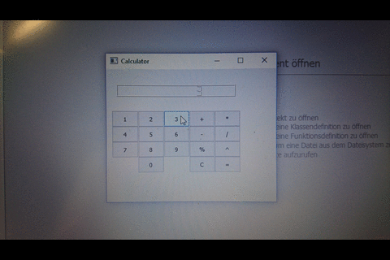

<snippet>
  <content>
# Matlab Taschenrechner

Das Programm GUI ist ähnlich einem Taschenrechner.
Mittels einer Qt-Oberfläche gibt es ein Eingabefeld und Buttons mit verschieden Grundrechenarten (Addition, Subtraktion, Multiplikation, Division, Modulo und Potenz).
Das Ergebnis wird im Eingabefeld angezeigt und die Operationen werden nach der Reihenfolge
ihrer Eingabe ausgeführt (Regeln wie „Punkt vor Strichrechnung“ werden also hier nicht beachtet).

## Example

## Die verschiedene Dateien

Die Definitionen der Funktionen für Eingabe, Buttons und Rechenoperationen befinden sich in der header-Datei ("calculator.h").
Die Initialisierungen dieser Funktionen sind in der "calculator.cpp" Datei zu finden und in der "main.cpp" Datei werden die Calculator-Funktion und das Qt-Eingabefenster aufgerufen.

## Beschreibung aller Funktionen

Auslesen der Ziffern ("on_pushButton_0_clicked"):
Sobald eine Ziffer geklickt wird und vorher die "=" - Taste schon geklickt wurde, wird die vorherige Ziffer aus dem Eingabefenster gelöscht, und die neue Ziffer wird in der Variable "currentValue" gespeichert und angezeigt.

 Falls eine Rechenart geklickt wurde, wird die Funktion "Rechenreihenfolge" aufgerufen und die Variable "operatorPressed" wird ein Nummer aufgewiesen.

"Rechenreihenfolge":
Hier wird die Übergabe der Zahlen auf verschiedene Variablen je nach Eingabenkombination organisiert. Es wird also verfolgt ob eine Rechenoperation und/oder die "=" - Taste gedrückt wurden.
Beispiel: Gerade eingegebene Ziffern werden zunächst auf der Variable "currentValue" gespeichert. Wenn in der Rechenreihenfolge-Funktion erkannt wird, dass bisher weder eine Operation, noch = gedrückt wurde, dann wird die eingegebene Ziffer auch auf der Variable "resultValue" gespeichert.
Wenn hingegen sowohl eine Operation als auch "=" gedrückt wurde, dann wird das ganze auf der Variable "eingabeValue" gespeichert.

"on_pushButton_gleich_clicked":
In dieser Funktion werden alle Operationen ausgeführt. Die Variable "operatorPressed" wird zunächst abgefragt. Je nach Abfrage wird die entsprechende Rechenoperation nun mit den Variablen "resultValue" und "eingabeValue" ausgeführt. Hier wird auch ersichtlich, warum es notwendig ist mit drei Variablen zu arbeiten. Bei der Variable "currentValue" handelt es sich um eine Übergabe Variable, die die Eingabe an "eingabeValue" weitergeben kann. Das ist notwendig, damit keine Werte an den flaschen Stellen überschrieben werden. Am Ende dieser Funktion werden "currentValue" und "eingabeValue" wieder auf 0 gesetzt, damit mit neuen Eingaben weitergerechnet werden kann. Auch die operatorPressed-Funktion wird auf 0 gesetzt damit sie neu ausgelesen werden kann. Die Variable "resultValueR hingegen behält den Wert,damit weitergerechnet werden kann und "gleich_clicked" wird von false auf true gesetzt. Auf diese Weise wird kommuniziert, dass die "=" - Taste schon gedrückt worden ist (entscheidend in der Rechenreihenfolge-Funktion).

"on_pushButton_clear_clicked":
In der clear-Funktion wird alles auf 0 gesetzt, damit wieder von vorne angefangen werden kann.

]]></content>
  <tabTrigger>readme</tabTrigger>
</snippet>
